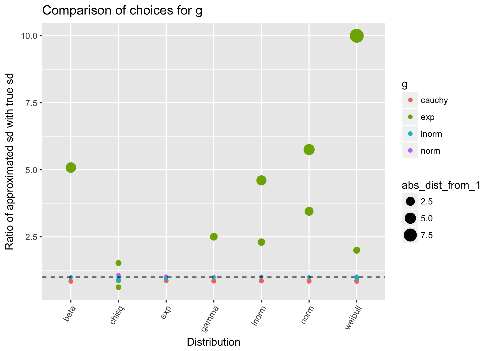
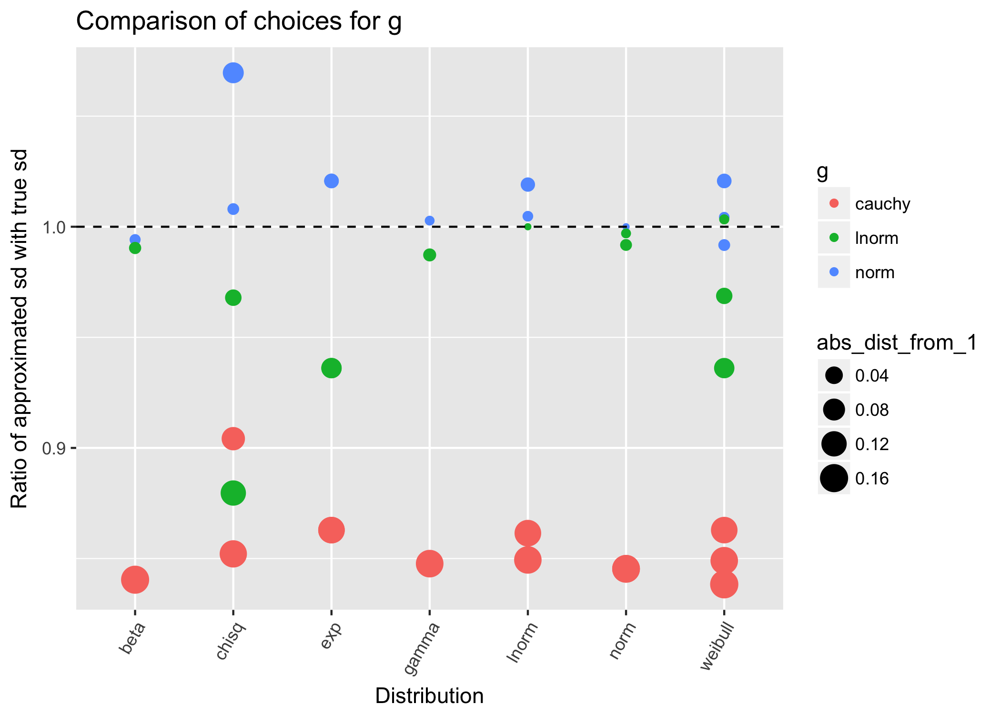
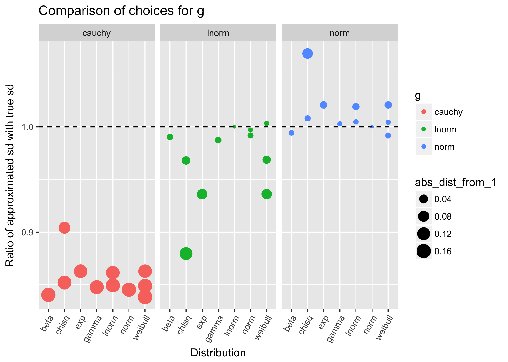
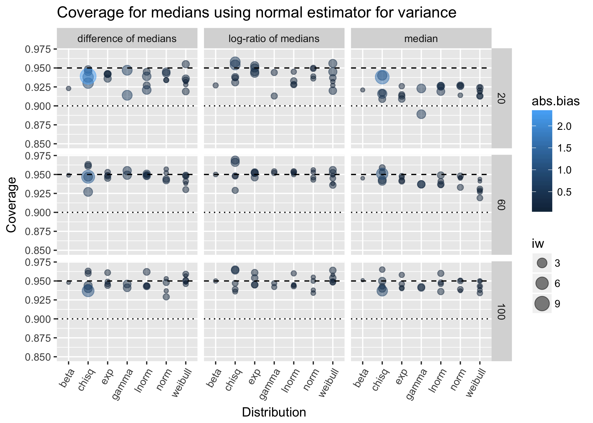
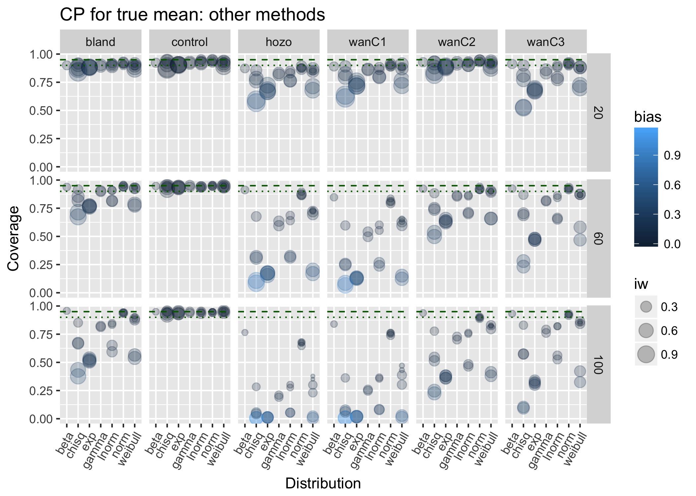
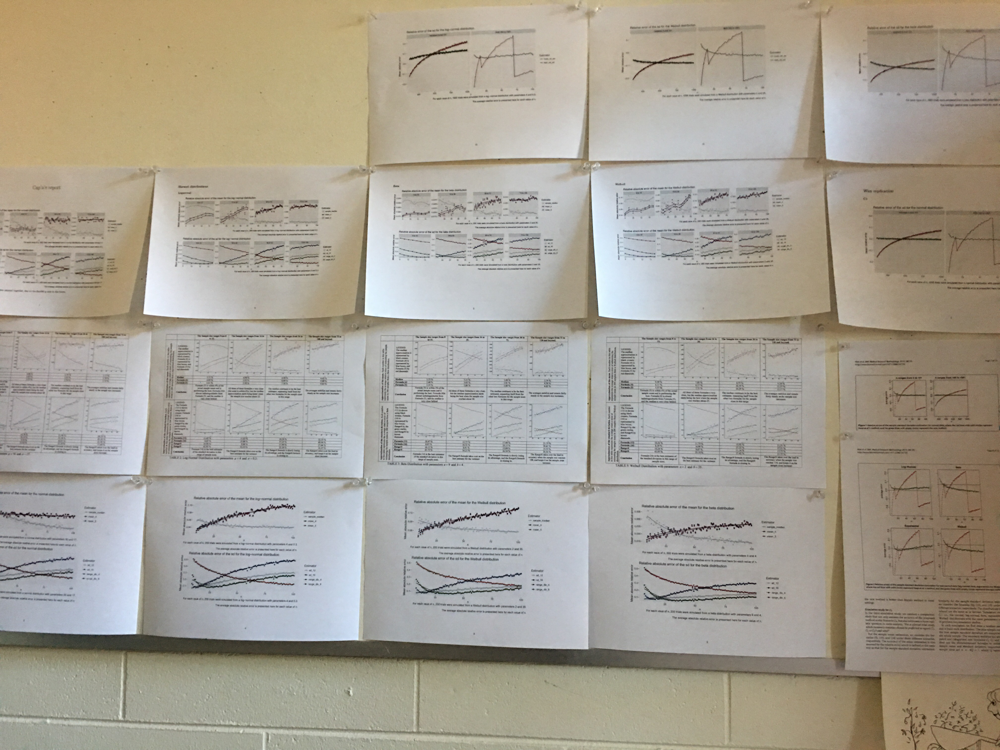
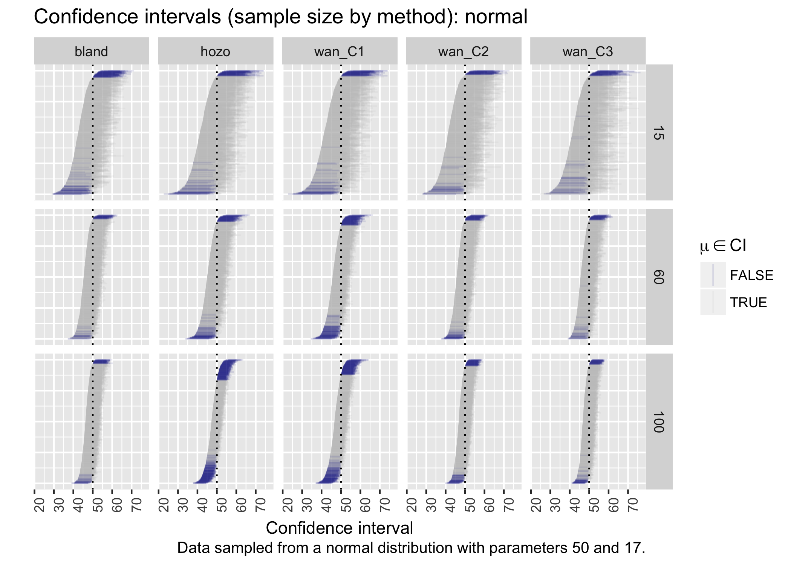
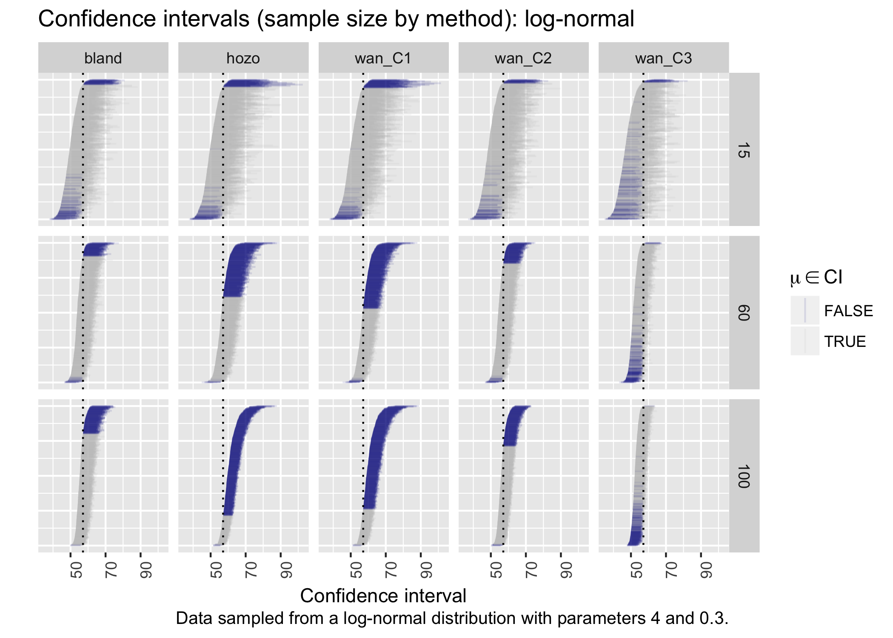
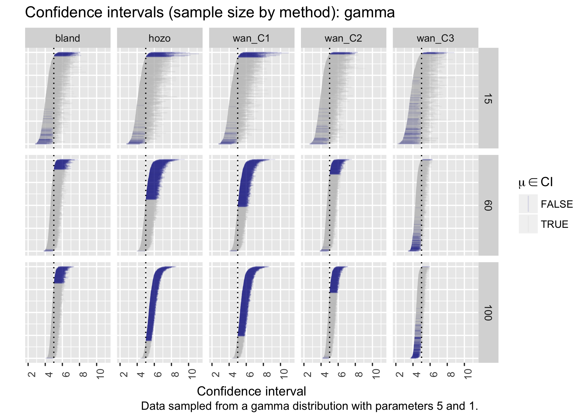

```{r setup, include=FALSE}
options(htmltools.dir.version = FALSE)
```


class: inverse, center, middle
# Hello, world.
Open with a quirky story of **local** flavour. 

(Hint: tell the story about forgetting the atonal piece.)

---
class: center, middle

# More like Curious Case of the Misbehaving function

Spoiler alert: it was the `cross` `r icon::fa_bug()` function that did it. 
***

Couldn't get it or `map` to play nice with a nested list with a vector that either was `null` or `numeric`.
***

**All visualisations are stand-ins.** 

---
class: inverse, center, middle
# Introduction: the `ggplot` generation

---
## Introduction: the `ggplot` generation
- How did this talk come about?
***
--

- What can I show you that you haven't seen already?
- Who am I? (Happy birthday to me.)

---
## Introduction: the `ggplot` generation

### Learning statistics & `ggplot` at the same time.

- Dataframes & `tidyverse`
- Reflections at $\frac 1 2 \cdot$ PhD.

---
## Introduction: the `ggplot` generation

- Here to learn from you.
- Coding in isolation; social experiment.
--

***
- Questions, discussion, and comments are invited.
- A **rowdy atmosphere** is encouraged.

---
## Introduction: the `ggplot` generation
I started with shiny apps.
- [Best choice of substitute density?](https://softloud.shinyapps.io/MedianV_current/)
- [Ratios](https://softloud.shinyapps.io/MedianCI/)
***

--
### Question to ponder
How would you have engaged in statistical theory with these tools, today or yesterday? 


---
class: inverse, center, middle
# Thoughts from messing around

---
## Thoughts from messing around

- Not theoretical.
- Reflections results of **undirected exploration**.
***
--

- The **if you didn't cover it in undergrad** rule. 
- My **question** for you is, *should we?*
***
--

- Theory, *next*.

---
## Thoughts from messing around

### What makes a **good** visualisation?
--

- What are we most interested in? *This* is $y$.
- Is this always the case?
***
--

- Can we distill this to an algorithm for specific types of problems? (i.e., such as coverage probability simulations.)
- How to order variables by importance?
- Should we? Or should it **always** be subjective?
--

### Things that just *feel* right
- **Foremost, the measure of a visualisation is how well it answers the question you are asking.**
- **Clarity of science is always paramount.**

---
## Thoughts from messing around

### base`R` vs `ggplot`

- Perhaps at best **three variables** in base`R`.
- Flexible facets, shapes, colour, and size add more variables in `ggplot`.

---
class: inverse, center, middle
# Data stories: the dance of data

---
## Data stories: the dance of data


---
## Data stories: the dance of data


---
## Data stories: the dance of data


---
class: inverse, center, middle
# Coverage probability simulations

---
## Coverage probability simulations

### What is a coverage probability simulation?
--

Perform an experiment to see if $\widehat\theta$ is a good estimator for $\theta$.

---
## Coverage probability simulations

### For each **trial**:
- Generate a random sample of size **$n$** from a chosen **distribution** with population **parameter** $\theta$.
- Calculate $\widehat\theta$ and $\mathrm{se}_{\widehat\theta}$.
- Calculate confidence interval,
$$
\widehat\theta \pm \Phi^{-1}(0.975) \mathrm{se}_{\widehat\theta}.
$$
- Ask, 
  - $\theta \in \widehat\theta \pm \Phi^{-1}(0.975) \mathrm{se}_{\widehat\theta}$ 
  - or 
  - $\theta \not\in \widehat\theta \pm \Phi^{-1}(0.975) \mathrm{se}_{\widehat\theta}$?

---
## Coverage probability simulations

> The *coverage probability* is the proportion of **trials** in which the confidence interval contains the true value $\theta$. 

---
class: inverse, center, middle
# Visualising coverage probability simulations

---
## Visualising coverage probability simulations

Variables of interest:

- **Coverage probability**
- Distribution 
- Sample size
- Estimator
- Relative absolute bias
- Interval width


---
## Visualising coverage probability simulations



---
## Visualising coverage probability simulations


---
class: inverse, center, middle
# The Curious Case of the Disappearing Coverage

---
## The Curious Case of the Disappearing Coverage


---
## The Curious Case of the Disappearing Coverage


---
## The Curious Case of the Disappearing Coverage

## So what is going on?
***
--

## A dasterdly plot afoot?
***

--
## A **bug** in my code?


---
## A **bug** in my code?

)


---
## Wave plots: point estimates are so last century


---
## Wave plots: point estimates are so last century


---
## Wave plots: point estimates are so last century



---
# Questions

**Questions for you**
- Do we teach visualisation **adequately** to future analysts?
- Do you consider the impact of housing affordability and the lack of enforcable tenants' rights on your **renting** students in low socio-economic circumstances?
- Do put the **out** in outreach?

***

**Questions for me**
- Visualisation and stats, yes. But also: 
  - Abstract algebra and 17th-century counterpoint;
  - *Buffy the Vampire Slayer* and *Disney*;
  - Life as a **survivor** of a crappy childhood.
- You can ask me about **anything**. It's okay, really. Real stories **educate**.
- Did you want to play with the shiny apps again?
  - [Best choice of substitute density?](https://softloud.shinyapps.io/MedianV_current/)
  - [Ratios](https://softloud.shinyapps.io/MedianCI/)


---
## No packages were harmed in the making of this talk
- *Actually lots of my own packages were harmed irreparably in the making of this talk.*
- `tidyverse`
- `xaringan` presentation
- Get slides: `devtools::install_github("softloud/curiouscov")`


