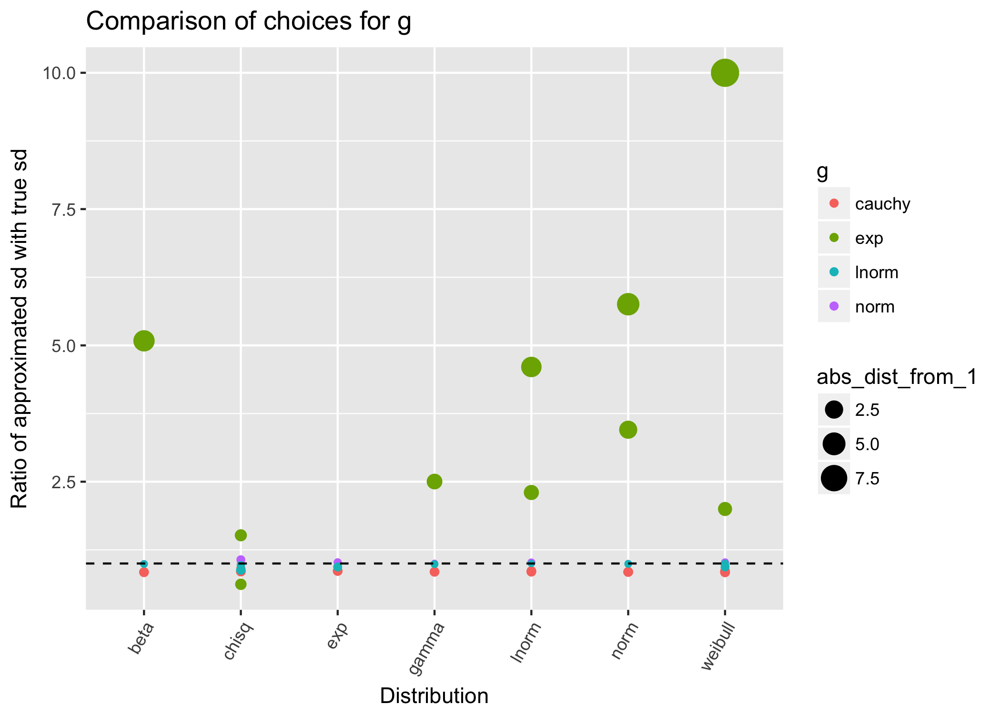
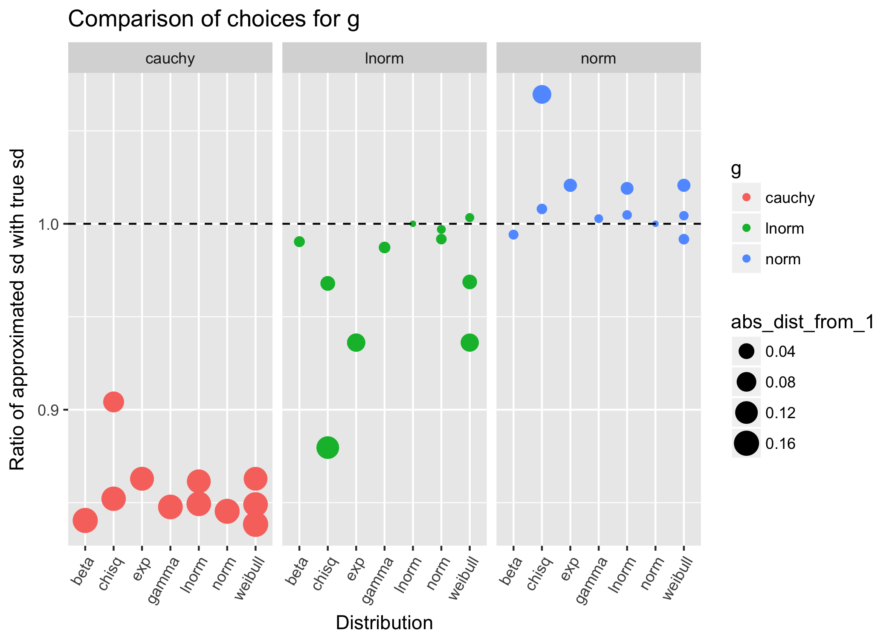
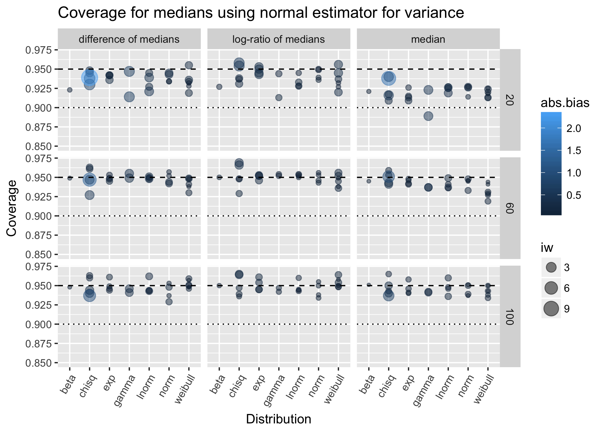
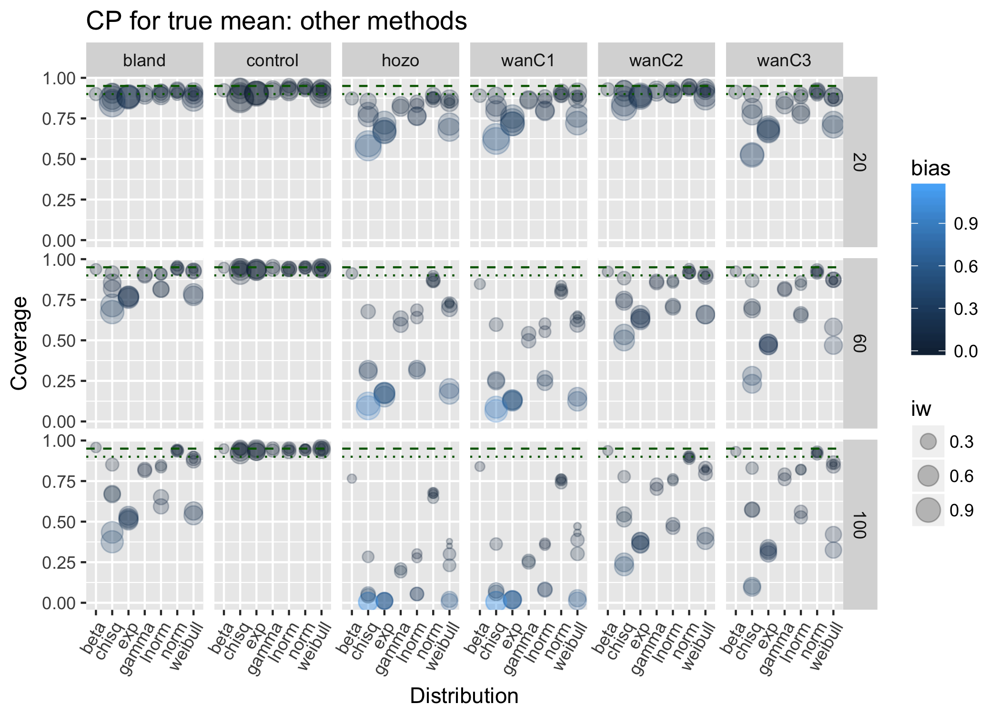

The Curious Case of the Disappearing Coverage: a detective story in visualisation
========================================================
author: Charles T. Gray, La Trobe University
date: Thursday 9 November 2017
autosize: true
incremental: true

The Curious Case of the Disappearing Coverage
========================================================
**A detective story in visualisation.**

- Introduction
- What makes a **good** visualisation?
- What are coverage probability simulations?
- Visualising coverage probability simulations
- The Curious Case of the Disappearing Coverage

Introduction: the ggplot generation
========================================================

- Open with a zesty story of local flavour.

Introduction: the ggplot generation
========================================================
## What can I show you that you haven't seen already?
- Who am I? (Happy birthday to me.)

## Learning statistics & `ggplot` at the same time.
- Dataframes & `tidyverse`
- Reflections at $\frac 1 2 \cdot$ PhD.

Introduction: the ggplot generation
========================================================
## Here to learn from you.
- Coding in isolation; social experiment.
- Questions, discussion, and comments are encouraged.

Thoughts from messing around
========================================================

- Not theoretical.
- **Undirected**.
- Theory, *next*.

Thoughts from messing around
========================================================

## What makes a **good** visualisation?

- What are we most interested in? *This is $y$*.
- Can we distill this to an algorithm?
- What are we most interested in observing an  
- **Foremost, the measure of a visualisation is how well it answers the question you are asking.**

## base`R` vs `ggplot`

- Perhaps at best **three variables** in base`R`.
- Flexible facets, shapes, colour, and size add more variables in `ggplot`.

Telling the story of the data
========================================================

Telling the story of the data
========================================================

Telling the story of the data
========================================================

Coverage probability simulations
========================================================

## What is a coverage probability simulation?
> Aim: Perform an experiment to see if the estimator  **parameter** $\theta$.

Visualising coverage probability simulations
========================================================

Variables of interest:

- **Coverage probability**
- Distribution
- Sample size
- Estimator
- Relative absolute bias
- Interval width

Visualising coverage probability simulations
========================================================
left: 70%

***
Variables of interest:

- **Coverage probability**
- Distribution
- Sample size
- Estimator
- Relative absolute bias
- Interval width

Visualising coverage probability simulations
========================================================

The Curious Case of the Disappearing Coverage
========================================================

